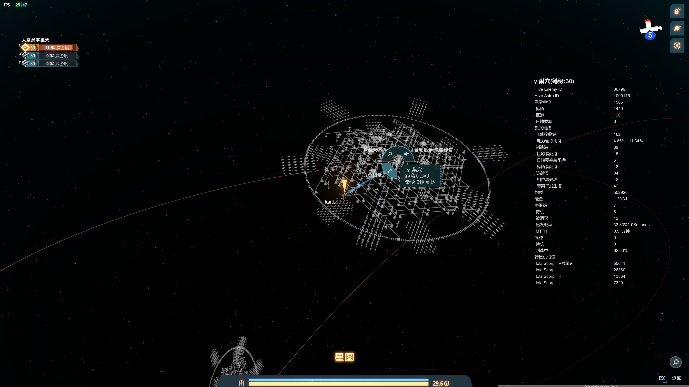

#Dark Fog Information
显示一些对战黑雾大概有用的星系来帮助小伊
This mod help Icarus fight dark fogs by prividing crucial information.

Version 1.0.2
##Language Support
中文 & English
##Features
1. Show informations of dark fog hive in star view
2. Show flying seed list, and create a navigation line to guide player to the nearest seed (or almost arrive seed)
3. Slow down and stop warp when player is near the seed, so Icarus can automatically call out his mighty fleet
4. Set anti-air turrets target priority pattern in local planet with 1 click (experimental)

##功能
1. 在星图界面显示太空巢穴的详细情报
2. 显示在途的火种，可以自动建立到最近火种的导航
3. 跃迁至火种附近会自动减速并停止
4. 批量设置本地炮塔的防空优先级(实验功能)

##用法 Usage
1. 点击巢穴查看详细，Click on hive to show details of the hive
2. 按Ctrl + X打开设置窗口，Use Ctrl + X to open the configuration window
    - Tinder: 显示火种列表以及自动目标设置，Show the flying seed list and auto navigation target check box
    - Space Hives：显示星系内巢穴简要信息， Show some digest information of hives in focus star system
    - Anti-air Bulk Config: 炮塔批量设置

#Preview
## Hive Detail

